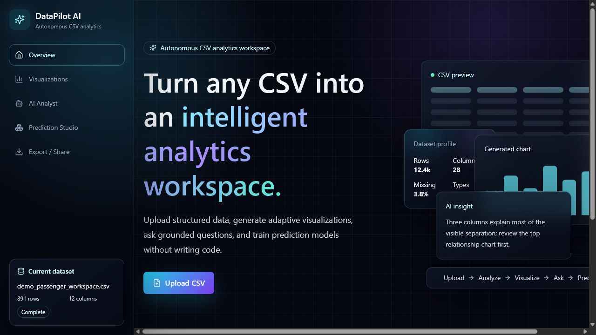
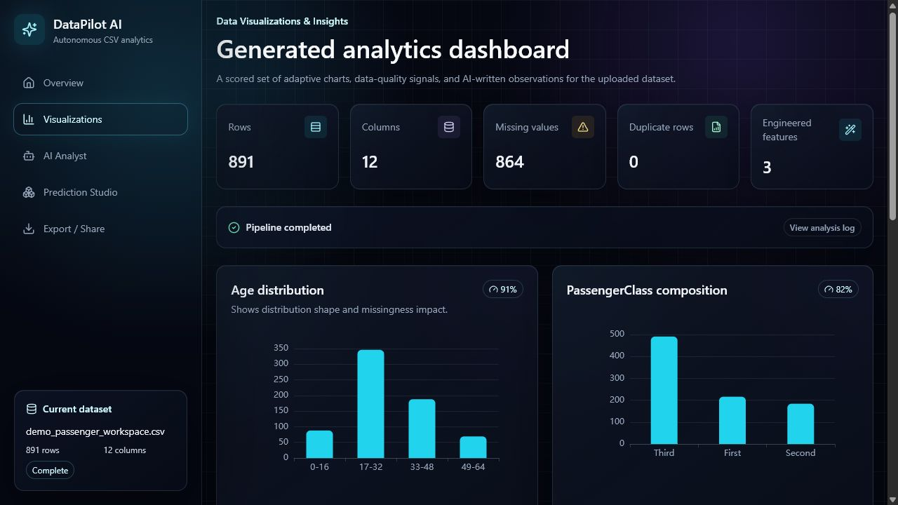
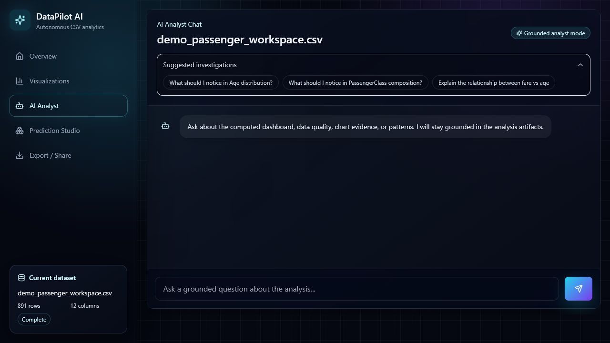
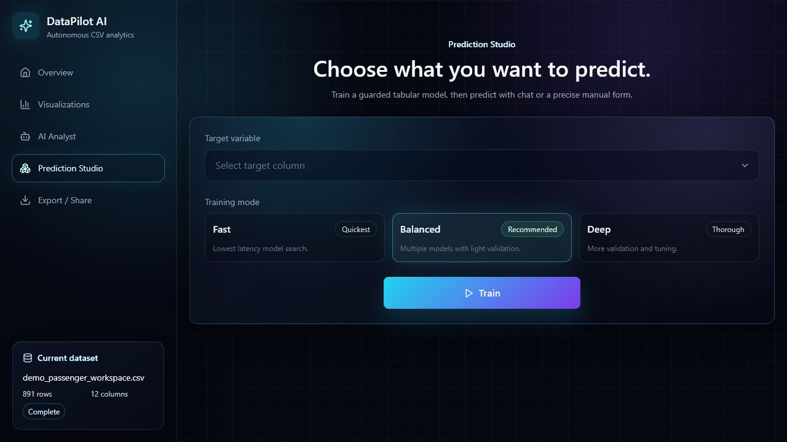
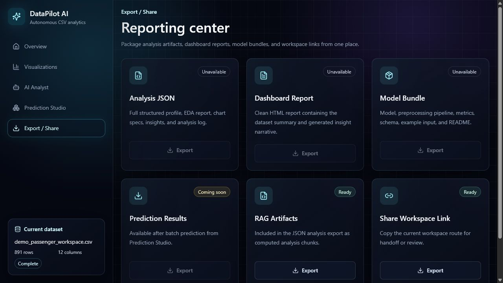
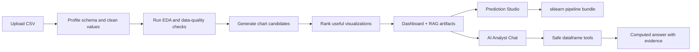

# DataPilot AI

DataPilot AI is an autonomous CSV analytics workspace. Upload a structured CSV and it turns the file into a polished analysis environment with adaptive charts, grounded AI analyst chat, exportable reports, and a tabular machine-learning prediction studio.

The app is built for local-first exploratory analytics: the backend computes statistics, charts, dataframe tool results, and model predictions; the LLM is used as a planner, interpreter, title writer, and natural-language extraction layer.

## Screenshots

### Overview



### Generated Analytics Dashboard



### AI Analyst Chat



### Prediction Studio



### Export Center



## What It Does

DataPilot AI helps you move from raw CSV to usable analytical workspace without writing code.

- Upload CSV files and automatically profile rows, columns, missing values, data types, and quality signals.
- Generate adaptive dashboards with chart candidates selected for analytical usefulness, not only technical validity.
- Ask grounded questions in the AI Analyst Chat, including computable dataframe questions such as averages, group comparisons, filters, counts, and correlations.
- Train tabular prediction models with sklearn pipelines, leakage checks, feature filtering, validation metrics, and live training progress.
- Predict with either a friendly chat interface or a reliable manual form generated from the trained feature schema.
- Export analysis JSON, report data, chart metadata, and model bundles.

## Feature Highlights

### Adaptive CSV Analysis

- Schema detection for numeric, categorical, boolean, datetime, and ID-like columns.
- Defensive column-level EDA so a single bad column does not crash the whole dataset analysis.
- Boolean-safe analytics that avoid invalid numeric percentile/IQR operations on true/false columns.
- Missing-value normalization so values like `nan`, `N/A`, `null`, empty strings, and `None` do not appear as real chart categories.
- Data quality artifacts for missingness, duplicates, suspicious columns, and outliers.

### Visualization Engine

- ECharts-powered dashboard cards with responsive bento-style sizing.
- Supported chart families include bar, horizontal bar, donut, histogram, boxplot, scatter, line, heatmap, correlation matrix, stacked/grouped comparisons, missingness charts, and model diagnostic charts where available.
- Chart intent classification for composition, ranking, distribution, relationship, trend, outlier/spread, correlation, missingness, group comparison, time pattern, and model diagnostics.
- Redundancy filtering for obvious formula-derived charts such as salary midpoint vs salary min/max, order amount vs tax amount, date parts vs each other, and ID-like columns.
- LLM-written chart titles and insights using clean chart metadata.

### AI Analyst Chat

- RAG over structured artifacts, not only free-text chart summaries.
- Tool-using dataframe analysis for filtered aggregations, group-by summaries, group comparisons, correlations, chart lookup, and column lookup.
- Natural-language column mapping for phrases like `sleep`, `stress`, `GPA`, `screen time`, or `productivity`.
- Computed answers include row counts, filters used, comparison baselines when possible, and caveats.
- Tool trace/debug information is available for observability without cluttering the main chat UI.

### Prediction Studio

- Target selection and Fast/Balanced/Deep training modes.
- Background model-training jobs with progress, step status, model cards, logs, elapsed time, and cancellation support.
- Task detection for classification vs regression.
- Leakage and unsuitable-feature filtering for targets, IDs, mostly unique identifiers, high-cardinality text, duplicate/constant columns, and suspicious post-outcome columns.
- sklearn `Pipeline` bundles that save preprocessing, estimator, feature schema, target metadata, metrics, excluded columns, leakage warnings, and random state.
- Classification metrics include appropriate accuracy/F1/precision/recall/ROC-AUC handling where possible.
- Regression metrics include MAE, RMSE, and R2 with baseline comparison.
- Manual prediction form uses the trained model feature schema, not every raw CSV column.
- Chat Prediction uses the LLM only to extract feature values; the trained sklearn model makes the actual prediction.

### Export And Share

- Export analysis JSON.
- Export dashboard/report data.
- Export chart metadata.
- Download trained model bundles.
- Share/workspace placeholders are presented gracefully where full sharing infrastructure is not implemented.

## Tech Stack

### Frontend

- React 18
- TypeScript
- Vite
- Tailwind CSS
- ECharts via `echarts-for-react`
- Framer Motion
- Lucide React icons
- Zustand workspace state

### Backend

- FastAPI
- Uvicorn
- pandas
- NumPy
- SciPy
- scikit-learn
- joblib
- OpenAI Python SDK
- Pydantic Settings

## Project Structure

```text
DataPilot AI/
  backend/
    app/
      main.py                    # FastAPI app entry point
      config.py                  # Environment-backed settings
      routes/
        datasets.py              # Upload/profile endpoints
        analysis.py              # Dashboard analysis endpoints
        chat.py                  # AI Analyst Chat endpoints
        prediction.py            # Training/prediction endpoints
        export.py                # Export endpoints
      services/
        analysis_service.py
        analyst_tool_service.py
        chart_service.py
        cleaning_service.py
        eda_service.py
        export_service.py
        feature_service.py
        insight_service.py
        llm_service.py
        prediction_service.py
        rag_service.py
        schema_service.py
        storage_service.py
        training_job_service.py
      utils/
        missing.py
    tests/
    requirements.txt
    .env.example
  frontend/
    src/
    package.json
  docs/
    screenshots/
  start.bat
  README.md
```

## How The App Works



The key safety rule: the LLM does not compute statistics or make model predictions by itself. Dataframe operations and ML predictions are executed by backend services.

## Installation

### Prerequisites

- Python 3.11 or newer
- Node.js 18 or newer
- npm
- Optional: an OpenAI API key for AI-generated insights, chat extraction, and richer analyst behavior

### Fast Start On Windows

Run:

```bat
start.bat
```

This starts:

- Backend API at `http://127.0.0.1:8000`
- Frontend app at `http://127.0.0.1:5173`

Open the frontend URL in your browser:

```text
http://127.0.0.1:5173/
```

Note: visiting `http://127.0.0.1:8000/` directly may show `{"detail":"Not Found"}` because the backend API has no root page. Use `/api/health` or the frontend URL.

### Backend Setup

```bash
cd backend
python -m venv .venv
.venv\Scripts\activate
pip install -r requirements.txt
copy .env.example .env
python -m uvicorn app.main:app --reload --host 127.0.0.1 --port 8000
```

Backend health check:

```text
http://127.0.0.1:8000/api/health
```

### Frontend Setup

Open a second terminal:

```bash
cd frontend
npm install
npm run dev -- --host 127.0.0.1 --port 5173
```

Frontend app:

```text
http://127.0.0.1:5173/
```

## Environment Variables

Create `backend/.env` from `backend/.env.example`.

```env
OPENAI_API_KEY=
OPENAI_MODEL=gpt-5-nano
OPENAI_EMBEDDING_MODEL=text-embedding-3-small
ENABLE_BACKEND_CHART_FALLBACK=false
MODEL_TRAIN_TIMEOUT_SECONDS=180
ENABLE_MODEL_TIMEOUTS=true
CORS_ORIGINS=http://localhost:5173,http://127.0.0.1:5173
```

Important:

- Do not commit real API keys.
- Without `OPENAI_API_KEY`, core CSV analysis and manual prediction can still work, but LLM-powered chat, title generation, insight writing, and Chat Prediction may be disabled or degraded.
- `OPENAI_MODEL=gpt-5-nano` is the intended low-cost model setting for this project.

## Usage

### 1. Upload A CSV

From the Overview page, click `Upload CSV` and select a structured CSV file. DataPilot will store the dataset locally for the running app session and begin analysis.

Good CSV candidates:

- ecommerce orders
- student performance data
- SaaS usage records
- HR/job data
- customer churn tables
- financial or operational exports

### 2. Generate The Dashboard

The Visualizations page shows:

- dataset-level metrics
- generated chart cards
- AI-written insights
- caveats and missing-value notes
- collapsed diagnostics/logs for debugging

### 3. Ask The AI Analyst

Use AI Analyst Chat for questions like:

```text
What is the average stress level for students who sleep less than 5 hours?
```

```text
Compare previous semester GPA for students sleeping 5 hours or less vs 8 hours or more.
```

```text
Which variables are most related to productivity?
```

For computable questions, the backend should run safe dataframe tools and return exact results with row counts and filters.

### 4. Train A Prediction Model

Open Prediction Studio:

1. Choose the target column.
2. Select Fast, Balanced, or Deep mode.
3. Start training.
4. Watch live progress, candidate models, logs, and metrics.
5. Use Chat Prediction or Manual Prediction after the model is ready.

### 5. Export Results

Open Export / Share to download analysis data, report payloads, chart metadata, or trained model bundles.

## API Overview

All application API routes are mounted under `/api`.

### Dataset Routes

- `POST /api/datasets/upload`
- `GET /api/datasets/{dataset_id}`
- `GET /api/datasets/{dataset_id}/profile`

### Analysis Routes

- `POST /api/datasets/{dataset_id}/analyze`
- `GET /api/datasets/{dataset_id}/analysis`
- `GET /api/datasets/{dataset_id}/charts`
- `GET /api/datasets/{dataset_id}/insights`

### Chat Routes

- `POST /api/datasets/{dataset_id}/chat`
- `GET /api/datasets/{dataset_id}/chat/last-trace`

### Prediction Routes

- `POST /api/datasets/{dataset_id}/models/train`
- `GET /api/training-jobs/{job_id}`
- `POST /api/training-jobs/{job_id}/cancel`
- `GET /api/datasets/{dataset_id}/models/{model_id}`
- `GET /api/datasets/{dataset_id}/models/{model_id}/stats`
- `POST /api/datasets/{dataset_id}/models/{model_id}/predict`
- `POST /api/datasets/{dataset_id}/models/{model_id}/chat-predict`
- `POST /api/datasets/{dataset_id}/models/{model_id}/batch-predict`
- `GET /api/datasets/{dataset_id}/models/{model_id}/download`

### Export Routes

- `GET /api/datasets/{dataset_id}/export/analysis`
- `GET /api/datasets/{dataset_id}/export/report`
- `GET /api/datasets/{dataset_id}/export/charts`

## Development Commands

### Backend

```bash
cd backend
.venv\Scripts\activate
python -m uvicorn app.main:app --reload --host 127.0.0.1 --port 8000
python -m pytest
```

### Frontend

```bash
cd frontend
npm run dev
npm run build
npm run preview
```

## Tests

Backend tests live in `backend/tests`.

Current test coverage includes:

- boolean-safe EDA
- chart redundancy detection
- analyst dataframe tools
- regression task training behavior

Run tests from the backend folder:

```bash
cd backend
.venv\Scripts\activate
python -m pytest
```

## Design Principles

- Clean data before charting it.
- Do not treat missing values as real categories in normal visualizations.
- Prefer useful charts over merely high-correlation charts.
- Keep the LLM away from raw unsafe code execution.
- Use backend dataframe tools for exact computations.
- Use sklearn pipelines for reproducible tabular prediction.
- Surface diagnostics when useful, but keep the primary UI polished and understandable.

## Troubleshooting

### `{"detail":"Not Found"}` at `127.0.0.1:8000`

That is the backend API server, not the frontend app. Open:

```text
http://127.0.0.1:5173/
```

For backend health:

```text
http://127.0.0.1:8000/api/health
```

### AI features are disabled

Check `backend/.env`:

```env
OPENAI_API_KEY=your_key_here
OPENAI_MODEL=gpt-5-nano
```

Restart the backend after changing environment variables.

### Frontend cannot reach backend

Confirm both servers are running:

- Frontend: `http://127.0.0.1:5173`
- Backend: `http://127.0.0.1:8000/api/health`

Also verify `CORS_ORIGINS` in `backend/.env` includes the frontend origin.

### Port already in use

Change the port in the command:

```bash
python -m uvicorn app.main:app --reload --host 127.0.0.1 --port 8001
npm run dev -- --host 127.0.0.1 --port 5174
```

If you change backend ports, update the frontend API base configuration if required.

### Prediction score looks too perfect

DataPilot flags suspiciously high scores because they may indicate target leakage, duplicate rows, or an easy deterministic target. Review excluded columns, leakage warnings, and Stats for Nerds before trusting the model.

## Privacy And Safety Notes

- Uploaded CSV files are processed by the local backend.
- LLM-powered features may send selected prompts, schema summaries, chart metadata, or extracted context to the configured OpenAI model.
- The LLM does not directly execute pandas code.
- The LLM does not make final sklearn predictions; trained backend models do.
- Never commit `backend/.env` or real API keys.

## License

MIT. See [LICENSE](LICENSE).
